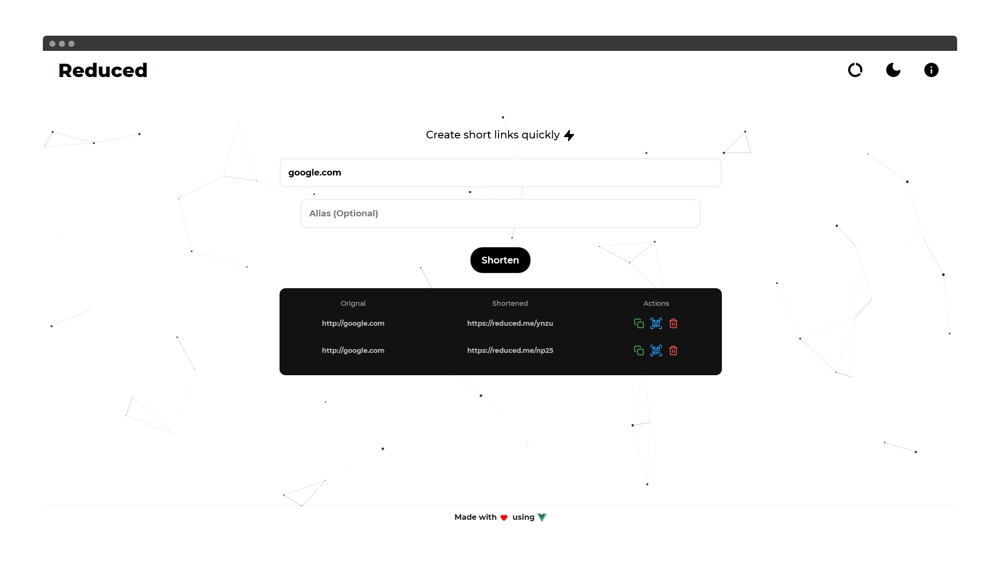
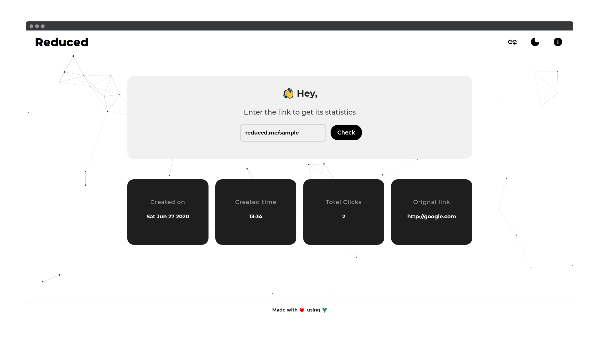

# Reduced


### 🔗 Reduced is a powerful modern custom URL shortener with a minimalistic design made with MEVN stack by [Sumit Kolhe](https://github.com/sumitkolhe)

---

<div align="center">
  <br>
  
  
  <br>
</div>

## ✨ Features

:heart: **Lightweight and minimalistic design :** Modern minimalistic design that is a treat for the eyes.

:zap: **Easy to use :** Simple and intuitive design thats easy to use.

:rainbow: **Support for Custom Aliases :** Support user defined custom aliases as well as randomly generated ones.

:iphone: **QR Code Support :** Generates QR Code for shortened links instantly.

:card_file_box: **Store previous links :** Stores previously shortened links in **localStorage** of the browser for easy access.

:rocket: **Performance :** Reduced is built using the MEVN stack to ensure lightning-fast speeds and great performance.

:pencil2: **Public API :** Free public API that can be used to shorten links quickly or implemented on any other frontend.

:wastebasket: **Auto link deletion :** All shortened links are automatically deleted affter 10 days of creation.

:lock: **Secure :** We don't collect any data about you or store logs in our server.

---

## 🖥️ Demo

[https://reduced.me](https://reduced.me)

---

## 🧰 Built with

- **VueJS** : Frontend framework
- **Vuetify** : Vuejs Framework
- **Express** : Backend server
- **Nodejs** : Javascript runtime engine
- **MongoDB** : Data storage

---

## :construction_worker: SETUP

- Clone the repository or download the latest [release](https://github.com/sumitkolhe/Reduced/releases) to a folder of choice.

```
$ git clone https://github.com/sumitkolhe/Reduced
```

#### :building_construction: Backend Setup

- Install the dependencies for the backend

```
$ cd Reduced

$ npm install
```

- Rename the **.sample-env** file to **.env** and fill all the required fields

- To start the app

```
$ cd Reduced

$ npm run dev
```

> **NOTE :** Running only the backend server will use previously generated static files ( from server -> static ) of the frontend.

#### :art: Frontend Setup

- Make sure you have Vue-CLI installed, if not

```
$ npm install -g @vue/cli
```

- Install the dependencies for the frontend

```
$ cd client
$ npm install
```

- Rename the **.sample-env** file to **.env** and fill the required fields

- To run frontend only

```
$ cd client
$ npm run dev
```

- To build frontend

```
$ cd client
$ npm run build
```

> **NOTE :** All frontend builds will automatically be placed in **server -> static**. You can edit this in **client -> vue.config.js**

---

# :pencil: REST API Documentation

- Reduced comes with a fully functional API that can be used to create short links with support for custom Aliases. As of now no authentication is required for using the API.

- The API resides in **Reduced -> server** and can be modified as per one's use case

### :alembic: Features of the REST API

- Allow creating short URLs with or without custom aliases.
- GET link statistics for shortened URLs. This includes -

	* Total number of clicks
	* Date / Day of Creation
	* Time of Creation
	* Original link

- The API comes with **Rate-Limiting** by default. The settings can be changed as per one's requirements.

- **CORS** is also enabled by default

---

# :triangular_flag_on_post: REST API

The REST API requests and endpoints are described below.

## # Create a short link

`POST /api/shorten/`

### Creating short URL **without** custom alias

```
curl --header "Content-Type: application/json" \
--request POST \
--data '{"longurl":"google.com"}' \
http://localhost:80/api/shorten
```

#### Response Object

```
{"clicks":0,
"stats":[],
"_id":"5ef749408887c725bc489620",
"alias":"ejrf",
"shorturl":"https://reduced.me/ejrf",
"longurl":"http://google.com",
"created":"2020-06-27T13:27:28.374Z",
"expire":"2020-07-07T13:27:28.374Z",
"__v":0}
```

### Creating short URL with custom alias

```
curl --header "Content-Type: application/json" \
--request POST \
--data '{"alias:"sample","longurl":"google.com"}' \
http://localhost:80/api/shorten
```

#### Response Object

```
{"clicks":0,
"stats":[],
"_id":"5ef74ae98887c725bc489621",
"alias":"sample",
"shorturl":"https://reduced.me/sample",
"longurl":"http://google.com",
"created":"2020-06-27T13:34:33.903Z",
"expire":"2020-07-07T13:34:33.903Z",
"__v":0}
```

### Failed Requests

- **Alias already exists :** API throws error if a custom alias is provided but it already exists in database.

```
curl --header "Content-Type: application/json" \
--request POST \
--data '{"alias":"sample","longurl":"google.com"}' \
http://localhost:80/api/shorten
```

#### Response Object

```
{"status":"AAE",
"message":"Alias already exists"}
```

- **Invalid link provided :** API throws error if an invalid link is supplied

```
curl --header "Content-Type: application/json" \
--request POST \
--data '{"longurl":"google"}' \
http://localhost:80/api/shorten
```

#### Response Object

```
{"status":"IURL",
"message":"Invalid URL"}
```

## # Get Link Statistics

`POST /api/check/`

```
curl --header "Content-Type: application/json" \
--request POST \
--data '{"linktocheck":"reduced.me/sample"}' \
http://localhost:80/api/check
```

#### Response Object

```
{"clicks":0,
"stats":[],
"_id":"5ef74ae98887c725bc489621",
"alias":"sample",
"shorturl":"https://reduced.me/sample",
"longurl":"http://google.com",
"created":"2020-06-27T13:34:33.903Z",
"expire":"2020-07-07T13:34:33.903Z",
"__v":0}
```

###  Failed Requests

- **Link does not exist :** When the supplied link to check does not exist in database.

```
curl --header "Content-Type: application/json" \
--request POST \
--data '{"linktocheck":"reduced.me/sampleinvalid"}' \
http://localhost:80/api/check
```

#### Response Object

```
{"message":"Link does not exist"}
```

- **Invalid Link :** When the supplies link is invalid **(is not an actual link)** is provided.

```
curl --header "Content-Type: application/json" \
--request POST \
--data '{"linktocheck":"invalidlink"}' \
http://localhost:80/api/check
```

#### Response Object

```
{"message":"Invalid Link"}
```

## # Check Server Status

`GET /api/status/`

```
curl --header "Content-Type: application/json" \
--request GET \
http://localhost:80/api/status
```

```
{"status": "OK"}
```
---
## ✍️ Authors

- [**Sumit Kolhe**](https://github.com/sumitkolhe) - _Author_

---

## 📜 License

This project is licensed under the [MIT License](https://opensource.org/licenses/MIT) - see the [LICENSE](LICENSE) file for details.

---
